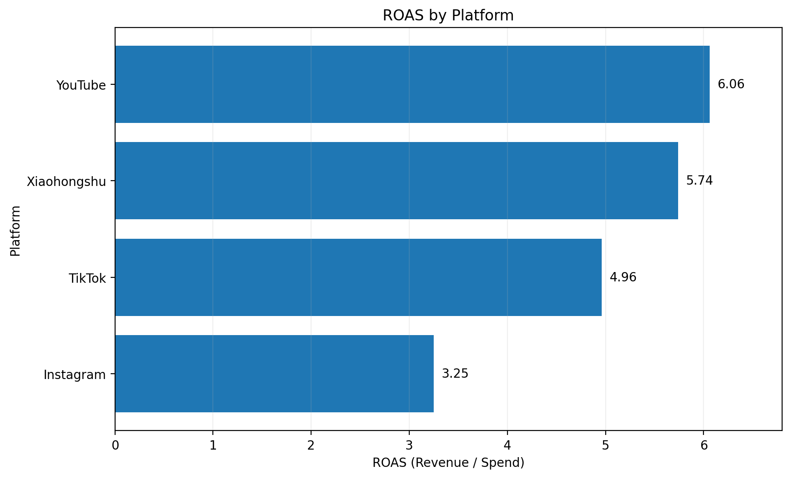

# AI + Digital Marketing Analysis

一个面向求职作品集的数字营销数据分析项目，展示从广告数据处理、SQL分析、核心指标诊断，到AI辅助广告优化与A/B Test设计的完整业务分析流程。

> Note：本项目使用模拟广告投放数据，主要用于展示数据分析、SQL业务诊断及AI辅助营销优化能力。

## 项目目标

本项目主要回答以下问题：

- 不同广告平台的投放效率有何差异？
- 哪些广告具有较高投入产出效率？
- 哪些广告存在“高点击、低转化”问题？
- 如何基于CTR、CVR、CPA、ROAS对广告进行决策分层？
- 如何结合AI Prompt完成广告问题诊断和A/B Test设计？

## 技术栈

- Python
- Pandas
- SQL
- SQLite
- Excel / CSV
- Prompt Design
- AI-assisted Marketing Analysis

## 快速运行

### Python分析

`pip install -r requirements.txt`

`python src/analyze_ads.py`

运行后将在 `outputs/` 目录生成广告指标、平台汇总、素材汇总及 Top 广告结果。

### SQL分析

1. 使用 DB Browser for SQLite 创建数据库；
2. 执行 `sql/01_create_table.sql` 创建 `ads` 表；
3. 导入 `data/sample_ads.csv`；
4. 执行 `sql/02_analysis_queries.sql`；
5. 分析平台、素材、受众及单广告层面的 CTR、CVR、CPA、ROAS。

## 核心指标

- CTR = Clicks / Impressions
- CVR = Conversions / Clicks
- CPC = Spend / Clicks
- CPA = Spend / Conversions
- ROAS = Revenue / Spend

## 分析流程

数据导入  
→ Python数据处理  
→ SQL分组聚合与业务诊断  
→ CTR / CVR / CPA / ROAS分析  
→ 广告分层  
→ AI辅助优化  
→ A/B Test设计

## 可视化结果

### 各平台 ROAS 对比

从模拟数据结果看，YouTube 的 ROAS 最高，为 6.06；小红书次之，为 5.74；TikTok 为 4.96；Instagram 最低，为 3.25。说明不同平台在投入产出效率上存在明显差异，预算分配不能仅依据点击量，还应结合转化效率与收入回报综合判断。

## 核心业务发现

### 1. YouTube整体投入产出效率最高

YouTube 的 ROAS 为 6.06，为四个平台中最高，说明单位广告投入带来的收入回报最强。

### 2. 小红书转化效率最好

小红书 CVR 为 5.67%，CPA 为 14.05，表现为最高转化率和最低获客成本。

### 3. Instagram存在明显“高点击、低转化”问题

Instagram CTR 为 3.08%，为四个平台最高，但 CVR 仅为 4.79%，CPA 高达 24.32，ROAS 仅为 3.25。

说明问题可能不在“素材没人点”，而在点击后的承接环节，例如受众匹配、卖点、价格或落地页。

## 广告决策规则

为展示分析流程，本项目设置了示例规则：

- **Increase Budget**：ROAS >= 10 且 CPA <= 15
- **Optimize Conversion**：CTR >= 3% 且 CVR < 4%
- **Reduce / Review**：ROAS < 3
- **Monitor**：其他情况

> 以上阈值仅用于模拟分析演示，真实业务中应结合毛利率、获客目标、归因口径和历史基准进行调整。

## AI广告诊断案例

### Case 1：AD016 — Optimize Conversion

- Platform：Xiaohongshu
- Creative Type：Lifestyle
- Audience：Students
- CTR：3.37%
- CVR：1.87%
- CPA：42.76
- ROAS：1.50

核心问题：

高点击、低转化。素材具备一定吸引力，但用户点击后转化效率较弱。

建议：

- 优化学生群体受众定向
- 强化价格 / 产品价值表达
- 优化落地页承接
- 设计价格利益型 vs 场景价值型 A/B Test

详细分析：

`outputs/ai_review_AD016.md`

### Case 2：AD004 — Increase Budget

- Platform：YouTube
- Creative Type：Product Demo
- Audience：Young Professionals
- CTR：2.65%
- CVR：4.19%
- CPA：7.36
- ROAS：23.93

核心优势：

高投入产出、低获客成本，适合采用渐进式扩量。

建议：

- 小幅增加预算
- 复制高表现素材逻辑
- 拓展相似受众
- 持续监控CPA和ROAS

详细分析：

`outputs/ai_review_AD004.md`

## AI Prompt设计

项目中设计了结构化广告诊断 Prompt，用于根据平台、素材类型、受众、CTR、CVR、CPA、ROAS 等指标自动生成：

- 广告表现诊断
- 核心问题识别
- 原因解释
- 优化建议
- A/B Test方案
- 最终投放动作建议

相关 Prompt 文件：

- `prompts/creative_review_prompt.md`
- `prompts/ai_optimization_prompt.md`

## 项目结构

    ai-digital-marketing-analysis/
    ├── data/
    │   └── sample_ads.csv
    ├── images/
    │   └── platform_roas.png
    ├── outputs/
    │   ├── ads_with_metrics.csv
    │   ├── ai_review_AD004.md
    │   ├── ai_review_AD016.md
    │   ├── creative_summary.csv
    │   ├── platform_summary.csv
    │   └── top_10_ads.csv
    ├── prompts/
    │   ├── creative_review_prompt.md
    │   └── ai_optimization_prompt.md
    ├── sql/
    │   ├── 01_create_table.sql
    │   └── 02_analysis_queries.sql
    ├── src/
    │   └── analyze_ads.py
    ├── README.md
    ├── requirements.txt
    └── .gitignore

## 项目能力展示

本项目主要展示以下能力：

- Python数据处理
- SQL业务分析
- 广告指标分析
- 平台 / 素材 / 受众表现诊断
- 数据驱动的广告决策
- Prompt设计
- AI辅助营销分析
- A/B Test设计
- GitHub项目沉淀与复现

## 项目说明

本项目中的广告数据为模拟数据，重点在于展示数据分析方法、SQL业务诊断逻辑、AI Prompt设计及营销优化思路，不代表真实商业投放结果。
